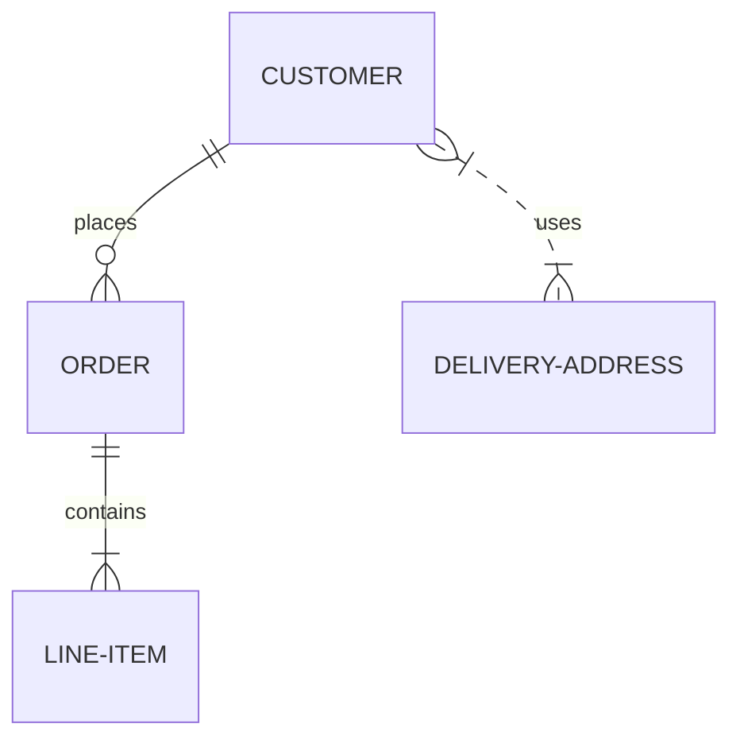
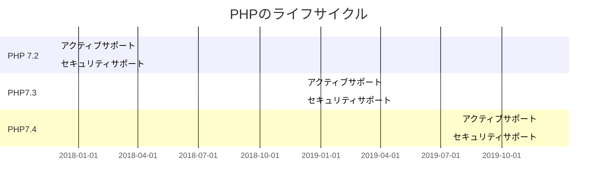
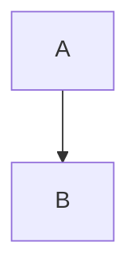

＃Lifequest とは？

## Web アプリ概要

家族の管理を行うことができる。

### できること

1. 家族のお金管理
2. 家族の目標管理
3. 家族の予定管理
4. 家族の経歴管理

## コーディングルール

1. 基本的に DDD をベースにコーディングをします。
2. Entity → DB のマップは mapper を使用 OK。
3. Entity → ViewModel は mapper を使用 OK。
4. DB → Entity、ViewModel → Entity は mapper ではなく、コンストラクタを使用すること。

# マイグレーション

# session 管理方法

```c#
    await HttpContext.Session.LoadAsync();
    var storeValue = HttpContext.Session.GetString("test1");
    Console.WriteLine(storeValue);
    if (storeValue == null)
    {
      Console.WriteLine("保存しにいってるよ");
      HttpContext.Session.SetString("test2", "テスト2");

      // Redisにデータを保存する
      await HttpContext.Session.CommitAsync();
    }
```

# JWT から uid を取得する方法　

```c#
var uid = User.Claims.Where(_ => _.Type == "user_id").First().Value;
```

※ user データを取得する場合は、authUserContext を使用すること

---
title: Order example
---





