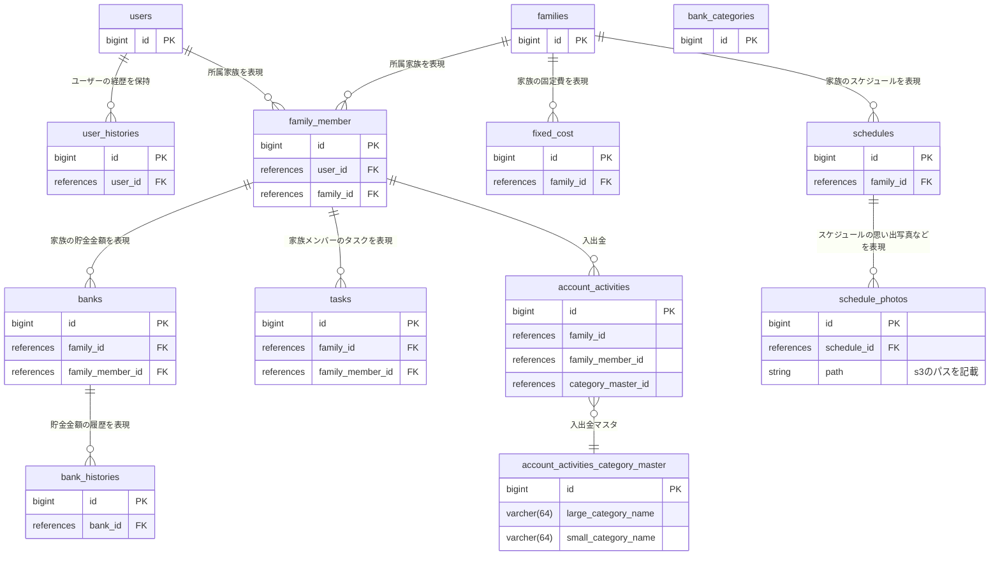

# 人生管理プロジェクト

## 技術スタック

### フロントエンド

言語: Typescript
フレームワーク: Anguler

### バックエンド

言語: C#, GO
フレームワーク: ASP .Net Core

### インフラ

- ECS
- Lambda
- AWS Aurora

## アーキテクチャー

DDD 採用

## ER 図

## 基本設計

### カテゴリー一覧

account_activities_category_master に入る値を一覧で列挙する。

- 食費: 1
  -- 食料品
  -- カフェ
  -- 朝ご飯
  -- 昼ご飯
  -- 晩ご飯
  -- その他
- 日用雑貨: 2
  -- 消耗品
  -- 子ども関連
  -- ペット関連
  -- タバコ
  -- その他
- 交通 :3
  -- 電車
  -- タクシー
  -- バス
  -- 飛行機
  -- その他
- 交際費: 4
  -- 飲み会
  -- プレゼント
  -- ご祝儀・香典
  -- その他
- エンタメ: 5
  -- レジャー
  -- イベント
  -- 映画・動画
  -- 音楽
  -- 漫画
  -- 書籍
  -- ゲーム
  -- その他
- 教育・教養: 6
  -- 習い事
  -- 新聞
  -- 参考書
  -- 受験料
  -- 学費
  -- 学質保険
  -- 塾
  -- その他
- 美容・服: 7
  -- 洋服
  -- アクセサリー・小物
  -- 下着
  -- ジム・健康
  -- 美容院
  -- コスメ
  -- エステ・ネイル
  -- クリーニング
  -- その他
- 医療・保健: 8
  -- 病院代
  -- 薬代
  -- 生命保険
  -- 医療保険
  --その他
- 通信: 9
  -- 携帯電話料金
  -- 固定電話彫金
  -- インターネット関連料金
  -- 放送サービス料金
  -- 宅配便
  -- 切手・ハガキ
  -- その他
- 水道・高熱: 10
  -- 水道料金
  -- 電気料金
  -- ガス料金
  -- その他
- 住まい: 11
  -- 家賃
  -- 住宅ローン返済
  -- 家具
  -- 家電
  -- リフォーム
  -- 住宅保険
  -- その他
- 車: 12
  -- ガソリン
  -- 駐車場
  -- 自動車保険
  -- 自動車税
  -- 自動車ローン
  -- 免許教習
  -- 高速料金
  -- その他

- 税金: 13
  -- 年金
  -- 所得税
  -- 消費税
  -- 住民税
  -- 個人事業税
  -- その他
- 大型出費: 14
  -- 旅行
  -- 住宅
  -- 自動車
  -- バイク
  -- 結婚
  -- 出産
  -- 介護
  -- 家具
  -- 家電
  -- その他
- その他: 15
  -- 仕送り
  -- お小遣い
  -- 使用不明金
  -- 立替金
  -- 未分類
  -- 現金の引出
  -- その他
  -- カードの引落
  -- 電子マネーにチャージ
